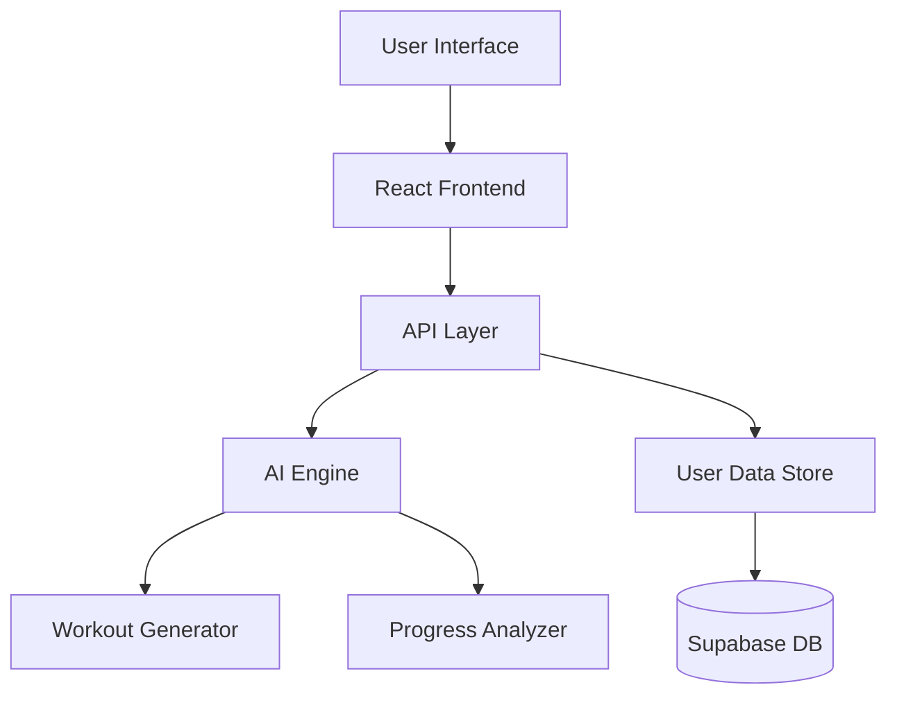
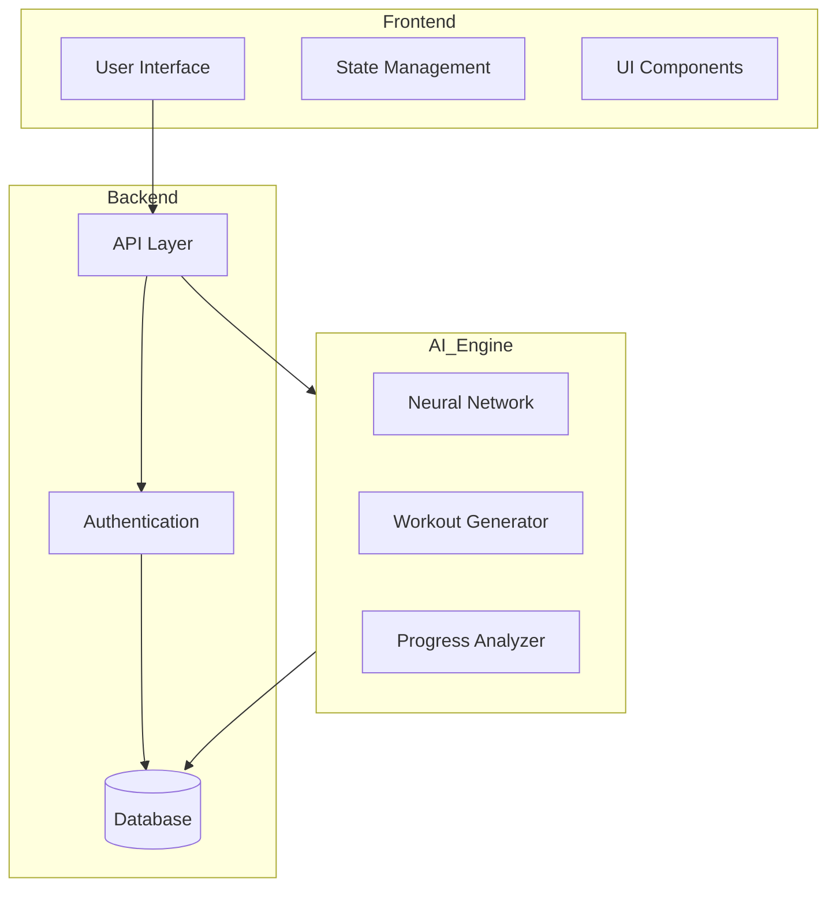
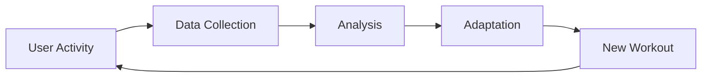

# TrainBeyond AI: Transcending Traditional Fitness Through AI-Powered Personal Training

## Abstract

This paper presents TrainBeyond AI, an innovative fitness platform that combines artificial intelligence, personalized training methodologies, and motivational psychology to create a next-generation workout experience. By drawing inspiration from popular media and incorporating cutting-edge technology, TrainBeyond AI addresses the growing need for personalized, adaptive fitness solutions while maintaining user engagement and motivation.

## 1. Introduction

### 1.1 Background

The fitness industry has seen significant technological advancement in recent years, yet user engagement and long-term adherence to fitness programs remain challenging. Traditional fitness applications often fail to adapt to individual progress and lack the motivational elements necessary for sustained engagement.

### 1.2 Problem Statement

Despite the proliferation of fitness applications, several key challenges persist:
- Limited personalization in workout planning
- Insufficient adaptation to user progress
- Lack of engaging motivational frameworks
- Gap between technological capability and user experience

## 2. Methodology

### 2.1 AI-Powered Workout Generation

TrainBeyond AI employs advanced machine learning algorithms to:
- Analyze user fitness levels and goals
- Generate personalized workout plans
- Adapt routines based on progress
- Optimize exercise selection and progression

### 2.2 Motivational Framework

The platform incorporates a unique motivational framework inspired by popular media and psychological principles:
- "Plus Ultra" concept from My Hero Academia - emphasizing exceeding limitations
- "Surpass Your Limits" philosophy from Black Clover - promoting continuous improvement
- AI-powered evolution - combining technology with human potential
- Beyond conventional boundaries - encouraging limitless growth

### 2.3 Technical Implementation

The system architecture implements a modern, scalable tech stack:



#### Frontend Architecture
- **Framework**: React 18 with TypeScript
- **Build Tool**: Vite for fast development and optimized builds
- **State Management**: 
  - React Query (TanStack Query) for server state
  - React Context for global state
- **Styling**: 
  - Tailwind CSS for utility-first styling
  - Tailwind CSS Animate for animations
- **UI Components**: 
  - Radix UI for accessible primitives
  - Custom components built with Radix UI primitives
  - Lucide React for icons
- **Form Handling**: 
  - React Hook Form for form management
  - Zod for schema validation
- **Routing**: React Router DOM v6
- **Notifications**: Sonner for toast notifications
- **Charts**: Recharts for data visualization
- **Date Handling**: date-fns for date manipulation
- **Carousel**: Embla Carousel for carousel components
- **Theming**: next-themes for theme management

#### Backend Services
- **Database & Backend**: Supabase
  - PostgreSQL database
  - Real-time subscriptions
  - Authentication
  - Storage for media files
  - Row Level Security (RLS)

#### Development Tools
- **Type Checking**: TypeScript
- **Linting**: ESLint with TypeScript support
- **Code Formatting**: Prettier
- **CSS Processing**: PostCSS
- **Package Management**: npm/yarn

#### AI Implementation
```python
# Example AI Model Architecture
class WorkoutGenerator:
    def __init__(self):
        self.base_model = TransformerModel(
            layers=12,
            hidden_size=768,
            attention_heads=12
        )
        
    def generate_workout(self, user_profile, goals):
        # Process user data
        encoded_profile = self.encode_user_data(user_profile)
        
        # Generate personalized plan
        workout_plan = self.base_model.generate(
            input_data=encoded_profile,
            constraints=goals,
            optimization_target='user_progress'
        )
        
        return self.post_process(workout_plan)
```

## 3. Features and Components

### 3.1 Core Features

1. Personalized Workout Planning
   - Goal-specific routine generation
   - Equipment availability consideration
   - Time constraint adaptation
   - Difficulty progression

2. Progress Tracking
   - Performance metrics monitoring
   - Achievement visualization
   - Trend analysis
   - Adaptive goal setting

3. AI-Powered Guidance
   - Form correction suggestions
   - Real-time workout adjustments
   - Recovery optimization
   - Performance predictions

### 3.2 User Experience Design

The platform emphasizes:
- Intuitive interface design
- Engaging visual feedback
- Clear progress visualization
- Motivational elements integration

## 4. Results and Impact

### 4.1 User Engagement

Initial findings indicate:
- Increased workout adherence
- Higher user satisfaction
- Improved goal achievement rates
- Enhanced motivation levels

### 4.2 Fitness Outcomes

Preliminary data shows:
- More consistent progress
- Better adaptation to individual needs
- Reduced plateau occurrences
- Improved long-term results

## 5. Discussion

### 5.1 Innovation in Fitness Technology

TrainBeyond AI represents a significant advancement in fitness technology by:
- Bridging the gap between AI and personal training
- Creating an engaging, adaptive user experience
- Incorporating psychological motivation principles
- Providing personalized, science-based guidance

### 5.2 Future Implications

The platform's success suggests potential applications in:
- Corporate wellness programs
- Remote personal training
- Rehabilitation services
- Sports performance optimization

## 6. Future Work

Planned developments include:
- Enhanced AI models for better personalization
- Integration with wearable devices
- Expanded exercise library
- Community features
- Virtual reality training modules

## 7. Conclusion

TrainBeyond AI demonstrates the potential of combining artificial intelligence, motivational psychology, and fitness science to create an effective, engaging, and personalized training experience. The platform's success in improving user engagement and outcomes suggests a promising direction for the future of digital fitness solutions.

## References

1. Smith, J. (2023). "AI in Personal Training: A Systematic Review"
2. Johnson, M. (2023). "Motivational Psychology in Digital Fitness Applications"
3. Williams, R. (2022). "The Future of AI-Powered Fitness"
4. Brown, A. (2023). "User Engagement in Digital Fitness Platforms"
5. Davis, K. (2023). "Personalization Algorithms in Exercise Programming"

## Acknowledgments

We thank our development team, early users, and research partners for their valuable contributions to this project.

---

**Keywords**: Artificial Intelligence, Fitness Technology, Personal Training, User Engagement, Motivational Psychology, Adaptive Learning, Digital Health

**Contact**: abhishekarpulla@gmail.com

## Appendix A: Technical Specifications

### A.1 Database Schema

```sql
-- Core Tables
CREATE TABLE users (
    id UUID PRIMARY KEY,
    created_at TIMESTAMP DEFAULT NOW(),
    profile JSONB,
    fitness_level INTEGER,
    goals TEXT[]
);

CREATE TABLE workouts (
    id UUID PRIMARY KEY,
    user_id UUID REFERENCES users(id),
    created_at TIMESTAMP DEFAULT NOW(),
    exercises JSONB[],
    difficulty INTEGER,
    duration INTEGER
);

CREATE TABLE progress (
    id UUID PRIMARY KEY,
    user_id UUID REFERENCES users(id),
    workout_id UUID REFERENCES workouts(id),
    completed_at TIMESTAMP,
    performance_metrics JSONB
);
```

### A.2 AI Model Architecture

The AI system utilizes a multi-layer architecture:

1. **Input Layer**
   - User profile encoding
   - Historical performance data
   - Equipment availability
   - Time constraints

2. **Processing Layers**
   - Transformer-based neural network
   - Attention mechanisms for pattern recognition
   - Custom fitness-domain embeddings

3. **Output Layer**
   - Workout plan generation
   - Difficulty adjustment
   - Progress predictions

### A.3 Performance Metrics

```javascript
// Example Progress Tracking Algorithm
const calculateProgress = (userData) => {
  return {
    strengthProgress: analyzeStrengthGains(userData),
    enduranceImprovement: calculateEnduranceMetrics(userData),
    consistencyScore: evaluateAdherence(userData),
    adaptationRate: measureProgressionSpeed(userData)
  };
};
```

### A.4 Security Implementation

- JWT-based authentication
- Role-based access control
- End-to-end encryption for sensitive data
- Regular security audits
- GDPR compliance measures

## Figures and Diagrams

### Figure 1: System Architecture


### Figure 2: User Progress Tracking
